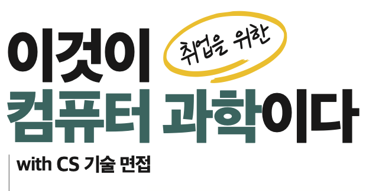
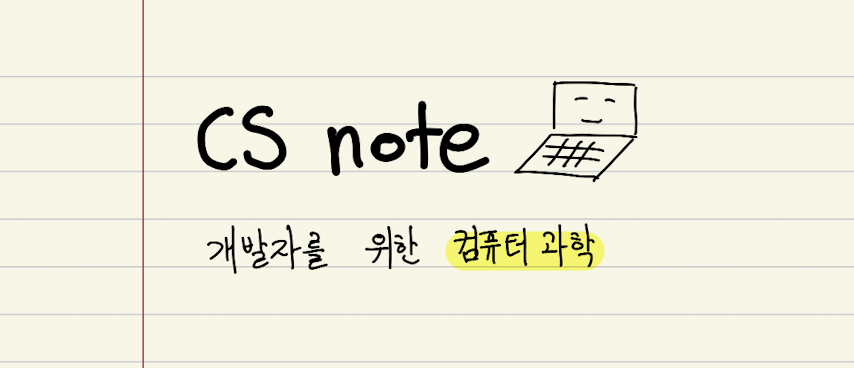

# 이것이 취업을 위한 컴퓨터 과학이다: 학습 자료

[도서 구매 링크](https://m.yes24.com/Goods/Detail/130179291)

## 정오표

**초판 기준 368 페이지에서 410 페이지까지  
<mark>조판 오류(페이지 쪽 수 표기 누락)</mark>가 발견되었습니다.**

정오표는 다음 링크에서 확인하실 수 있습니다.  
불편을 드려 죄송합니다.

[정오표](./etc/corrections.pdf)

## 추가 자료 목록

- [컴퓨터 구조](./arch/)
- [운영체제](./os/)
- [자료구조](./ds/)
  - [정렬 알고리즘 알아보기](./ds/sorting/)
  - [코드로 그래프 표현하기](./ds/graph/)
  - [코드로 트리 표현하기](./ds/tree/)
  - [코드로 순회 표현하기](./ds/traversal/)
  - [코드로 큐 표현하기](./ds/queue/)
  - [코드로 스택 표현하기](./ds/stack/)
  - [해시 충돌의 사례: SHA-1](./ds/hash/)
- [네트워크](./net/)
  - [로드 밸런싱을 위한 Nginx 환경 구축](./net/nginx/)
- [데이터베이스](./db/)
  - [MySQL 환경 구축](./db/mysql/)
  - [MongoDB 환경 구축](./db/mongodb/)
  - [Redis 환경 구축](./db/redis/)

## csnote (https://csnote.net)

본 서적에서 등장한 1000개 이상의 컴퓨터 과학 용어들을 정리했습니다.

### 질문이 있다면?

[issues](https://github.com/kangtegong/cs/issues)에 질문을 남겨주시거나 **tegongkang at gmail dot com** 으로 문의 보내주세요. 

문의에 답변 드리겠습니다.
